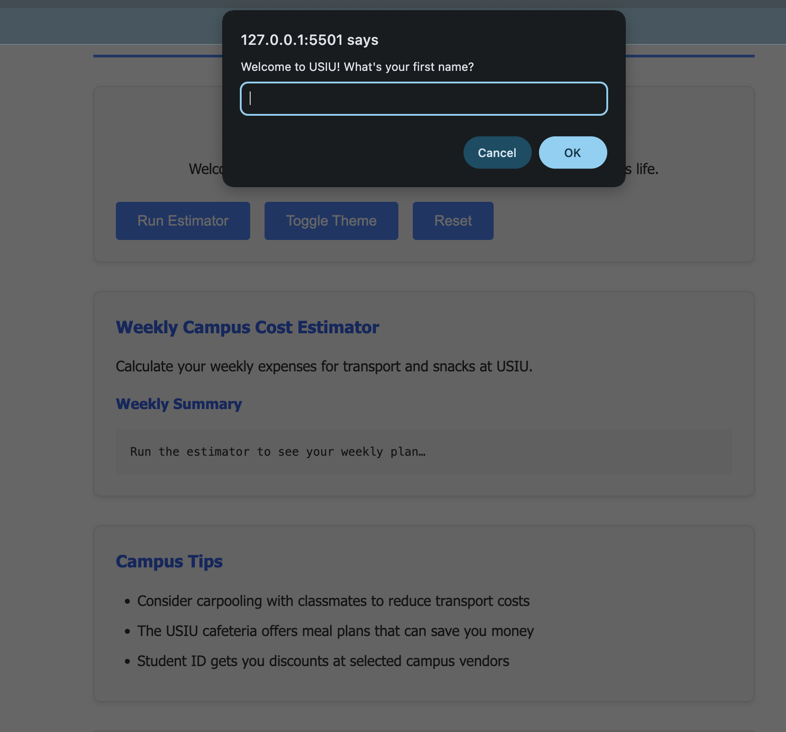

# USIU First-Year Companion (v1)

A lightweight, static microsite to welcome new USIU students during Orientation Week. Provides a personalized greeting, a weekly campus cost/commute estimator, and a day/night theme toggle.

## Features

- Personalized greeting with student name
- Weekly cost estimator for transport and snacks
- Theme toggle for day/night viewing + auto theme detection
- Mobile-first responsive design
- Docker containerization for easy deployment
- Single-file static site (no build step)

## Quick Start — Run locally (no Docker)

1. Clone the repository:
   git clone <repository-url>
2. Open the project folder:
   cd usiu-first-year-companion
3. Open the site in your browser:
   open public/index.html

(Alternatively, serve the `public` folder with a simple static server, e.g. `npx http-server public`)

## Build and Run with Docker

1. Build the Docker image:
   docker build -t usiu-first-year-companion .
2. Run the container and expose port 8080:
   docker run --rm -p 8080:80 usiu-first-year-companion
3. Open http://localhost:8080 in your browser.

Notes:
- The provided Dockerfile serves the `public` folder via nginx.
- Add a `.dockerignore` to exclude design artifacts and local files from the image.

## Usage

- Enter your name when prompted to receive a personalized greeting.
- Use the estimator to input daily transport/snack costs and days per week; results show weekly totals and a simple savings example.
- Toggle theme using the UI control; theme is also auto-applied based on local time.

## File structure

- public/index.html — main static page
- public/styles.css — styles and responsive rules
- public/script.js — interaction and estimator logic
- Dockerfile — container image that serves `public` via nginx
- design/ — optional design notes and wireframes

## Design notes & recommendations

- Current inputs use browser prompts for simplicity. Consider replacing prompts with an accessible form for improved UX and testability.
- Extract calculation logic from `public/script.js` into a small module so you can add unit tests.
- Persist name and theme in localStorage to remember user preferences.

## Contributing

- Open an issue or submit a pull request.
- Keep changes small and document behaviour changes in the PR description.

## License

no license available for this project

### Project preview

Below is a preview of the project, showcasing the clean and user-friendly interface of the USIU First-Year Companion microsite:
the project looks like this
" />
" />
" /> />
" />" />
" />" />

## Figma
Below are the project design before its implementation using Figma

" />" />
" />" />
## Contact

For questions or feedback, open an issue in this repository.